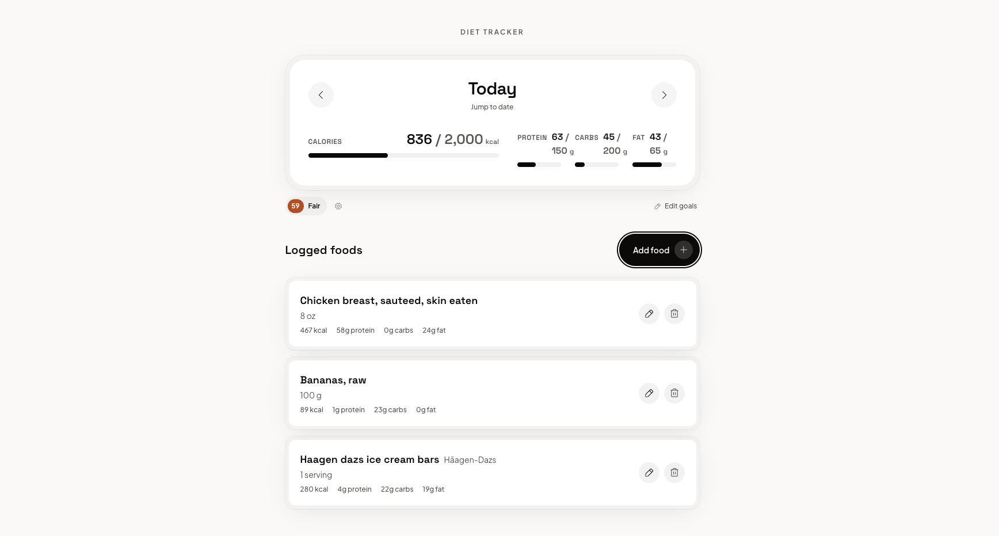

# Diet Tracker

A full-stack diet tracker — food search, daily logging, macro/calorie goals, and a configurable health score, backed by real nutrition data.

**[Live demo →](https://diet-tracker-client.vercel.app/)**



## Stack

- **Frontend:** React, Vite, TypeScript, Tailwind CSS
- **Backend:** Node.js, Hono
- **Database:** PostgreSQL (Neon), Drizzle ORM
- **External APIs:** USDA FoodData Central, Open Food Facts
- **Deployment:** Vercel (frontend), Render (backend)

## Architecture

Food search aggregates two upstream sources — USDA FoodData Central for whole/generic/homemade foods, Open Food Facts for branded/packaged items — normalizes both into one shape, and caches results in a `foods` table (deduped by source + external ID). A logged entry snapshots its resolved macros/calories at write time, so a later correction to a cached food's data never rewrites the history of a day already logged.

Both upstream APIs are free tiers and observably flaky under load (rate-limiting, transient 5xx). Search checks the local `foods` cache first and only falls back to a live upstream call when there aren't enough cached matches for the query — repeat and overlapping searches become fast and immune to that flakiness once a term is well-cached, at the cost of not always surfacing the newest possible upstream result for an already-cached term.

The health score is a weighted 0–100 composite over four independently toggleable factors (whole-food/processed via NOVA classification, macro fit vs. goals, sugar/sodium levels, food-group variety). Each factor is excluded from the composite — with the remaining factors' weights renormalized to fill the gap — whenever it's disabled or has no computable data for the day (e.g. macro-fit needs goals to be set; variety needs at least one logged food in a rolling 7-day window, since a single day's 2–4 items is too sparse a sample on its own).

There's no login. Each visitor is identified by a random ID generated on first visit and stored in `localStorage` — the only thing the client keeps client-side; logs, goals, and health-score settings all still live in Postgres, scoped to that ID, so different visitors never see each other's data. Goals and health-score settings are single-row-per-visitor tables behind a get-or-create/upsert pattern rather than real user accounts.

## API

- `GET /api/foods/search?q=` — search USDA + Open Food Facts, caching normalized results
- `GET /api/foods/:id` — a single cached food
- `POST /api/logs` — log a food for a date (snapshots its nutrition at write time)
- `GET /api/logs?date=YYYY-MM-DD` — a day's logged entries + totals
- `PATCH /api/logs/:id` / `DELETE /api/logs/:id` — edit or remove a logged entry
- `GET/PUT /api/goals` — daily calorie/protein/carb/fat targets
- `GET/PUT /api/health-score/settings` — master toggle, per-factor toggles + weights
- `GET /api/health-score?date=YYYY-MM-DD` — the day's composite score + per-factor breakdown

## Running locally

Requires Node.js, pnpm, and a Postgres database (or a Neon connection string).

```bash
pnpm install
cp .env.example .env
# fill in .env: DATABASE_URL, USDA_FDC_API_KEY (free: https://api.data.gov/signup/)

pnpm db:migrate
pnpm dev
```

Starts the client (`http://localhost:5173`) and the API server (`http://localhost:3000`) together.

Other scripts: `pnpm build`, `pnpm test`, `pnpm typecheck`, `pnpm lint`.
